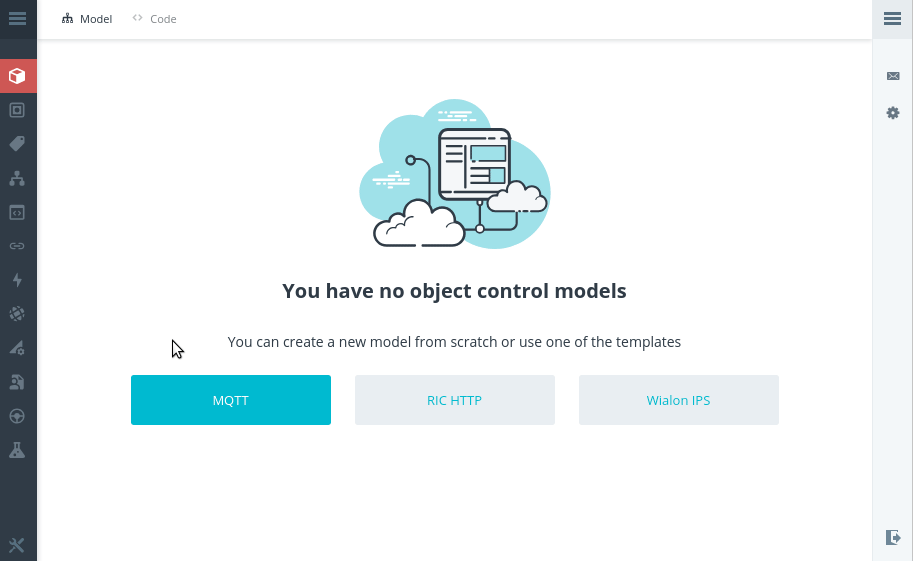
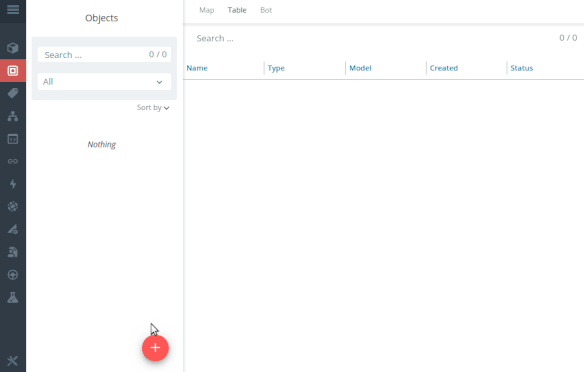
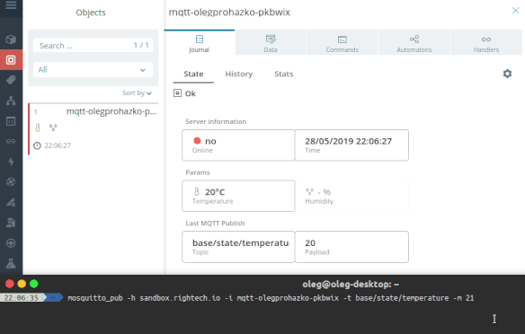

# Rightech IoT with MQTT

## Quick start

### 1. Create MQTT model




### 2. Create object




### 3. Send some payloads



For example with `mosquitto_pub` client from [Eclipse Mosquitto](https://mosquitto.org/download/) project.

```console
$ mosquitto_pub -d -h sandbox.rightech.io -i <ric-mqtt-client-id> -t base/state/temperature -m 23
$ mosquitto_pub -d -h sandbox.rightech.io -i <ric-mqtt-client-id> -t base/state/temperature -m 24
```

## Examples

### (:construction:) 101  Hello MQTT

### (:construction:) 102  Connect DHT11

### (:construction:) 103  Publish JSON

### (:construction:) 104  TLS


## Connect


| Project       | With example model     |  Config
| ------------- | ------------- | ----------
| [OpenMQTTGateway](https://github.com/1technophile/OpenMQTTGateway)   | (:construction:)  | -
| [zigbee2mqtt](https://github.com/Koenkk/zigbee2mqtt)                 | [mqtt-zigbee2mqtt](../.ric-models/mqtt-zigbee2mqtt.ric-model.json)  | -
| [LoRa Server](https://github.com/brocaar/loraserver)                 | [mqtt-loraserver-td11](../.ric-models/mqtt-loraserver-td11.ric-model.json)  | -
