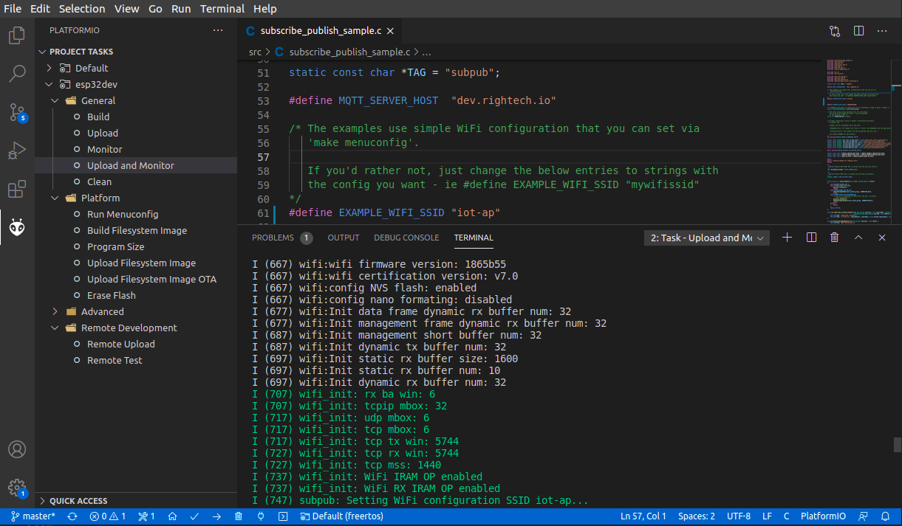

- [Original example](https://github.com/platformio/platform-espressif32/tree/v3.1.1/examples/espidf-aws-iot) from [platformio/platform-espressif32](https://github.com/platformio/platform-espressif32) with [diff](https://github.com/Rightech/ric-examples/commit/76ae37dcc44ec72e0eff876398967eefda2c2e1a)

### 1. Issue X.509 client certificate in Righech IoT


- Copy certificate to [src/certs/certificate.pem.crt](./src/certs/certificate.pem.crt) file
- Copy key to [src/certs/private.pem.key](./src/certs/private.pem.key) file

### 2. Define your network credentials 

In file [src/subscribe_publish_sample.c](./src/subscribe_publish_sample.c#L55-L62)
```cpp
#define EXAMPLE_WIFI_SSID "..."
#define EXAMPLE_WIFI_PASS "..."
```

or in menuconfig `> pio run -t menuconfig`

### 3. Build and flash


- Install [PlatformIO Core (CLI)](https://docs.platformio.org/en/latest/core/installation.html) or [PlatformIO IDE](https://docs.platformio.org/en/latest/integration/ide/vscode.html#installation) for VS Code

- Plug your ESP32 and run

```bash
> pio run -t upload && pio device monitor
```
 - Or click `Upload and Monitor` in `PlatformIO IDE`



If you're on Linux and run at
```bash
PermissionError: [Errno 13] Permission denied: '/dev/ttyUSB0'
```

Configure [udev.rules](https://docs.platformio.org/en/latest/faq.html#platformio-udev-rules) or run
```bash
> sudo adduser $(whoami) dialout
> sudo chmod a+rw /dev/ttyUSB0
```
