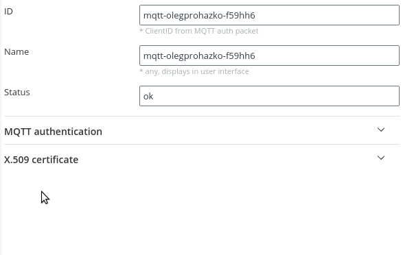

- [Original example](https://github.com/platformio/platform-espressif32/tree/v3.1.1/examples/espidf-aws-iot) from [platformio/platform-espressif32](https://github.com/platformio/platform-espressif32) repo.  

### 1. Generate X.509 client certificate in Righech IoT:



- Copy certificate to [src/certs/certificate.pem.crt](./src/certs/certificate.pem.crt) file
- Copy key to [src/certs/private.pem.key](./src/certs/private.pem.key) file

### 2. Define your network credentials 

In file [src/subscribe_publish_sample.c](./src/subscribe_publish_sample.c#L55-L62)
```cpp
#define EXAMPLE_WIFI_SSID "..."
#define EXAMPLE_WIFI_PASS "..."
```

or in menuconfig `> pio run -t menuconfig`

### 3. Build and flash

Install [PlatformIO Core](https://docs.platformio.org/en/latest/core/installation.html), connect your ESP32 and simply run

```bash
> pio run -t upload && pio device monitor
```

If you run at `Permission denied` error
```bash
Auto-detected: /dev/ttyUSB0
Uploading .pio/build/esp32dev/firmware.bin
esptool.py v3.0
Serial port /dev/ttyUSB0
Traceback (most recent call last):
  File "/home/prohazko/.platformio/penv/lib/python3.8/site-packages/serial/serialposix.py", line 322, in open
    self.fd = os.open(self.portstr, os.O_RDWR | os.O_NOCTTY | os.O_NONBLOCK)
PermissionError: [Errno 13] Permission denied: '/dev/ttyUSB0'

During handling of the above exception, another exception occurred:
```

try 

```bash
> sudo adduser $(whoami) dialout
> sudo chmod a+rw /dev/ttyUSB0
```
or configure [udev.rules](https://docs.platformio.org/en/latest/faq.html#platformio-udev-rules)
