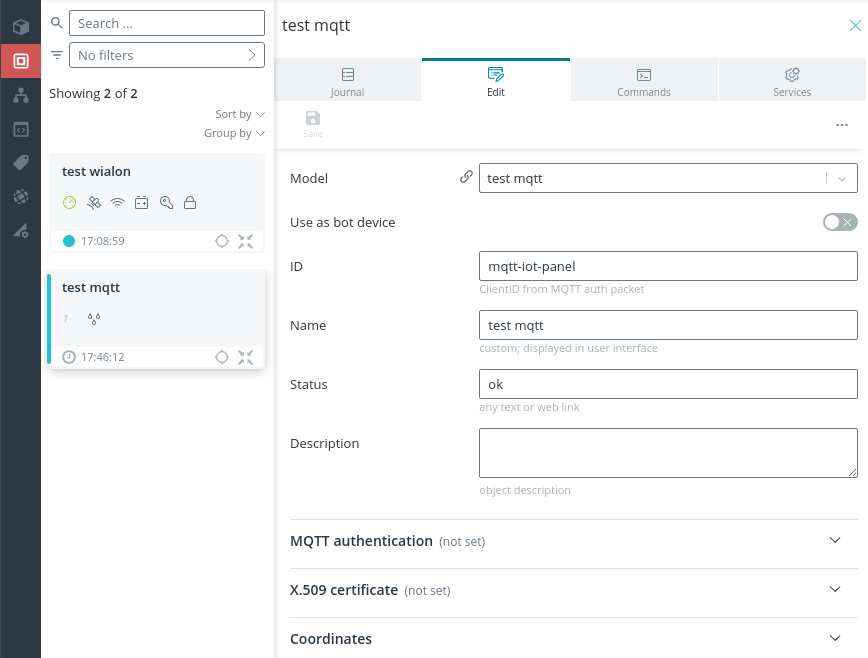
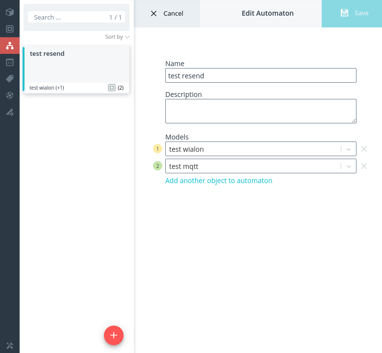
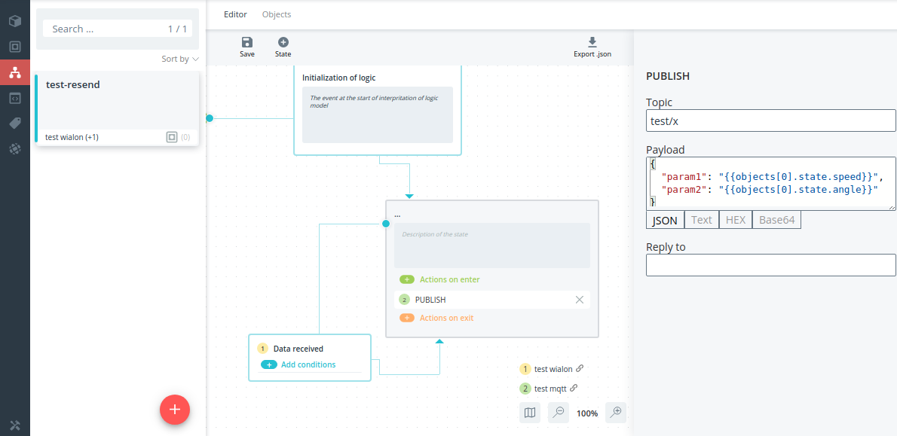
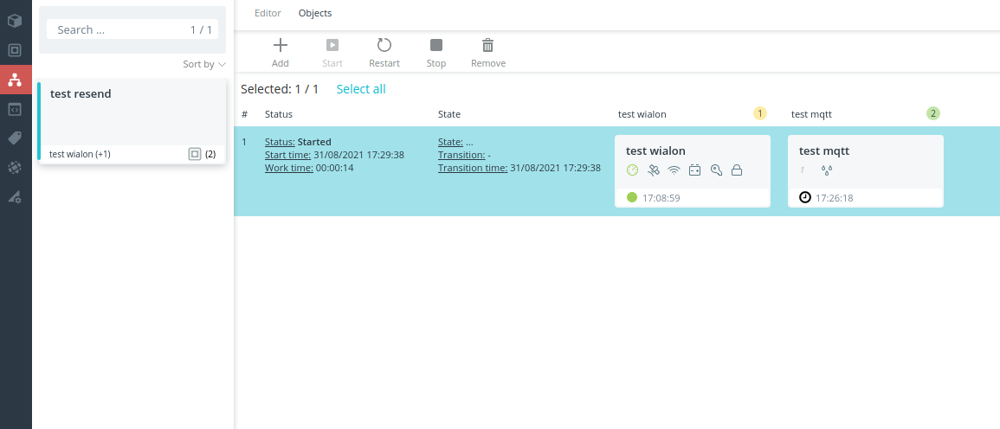
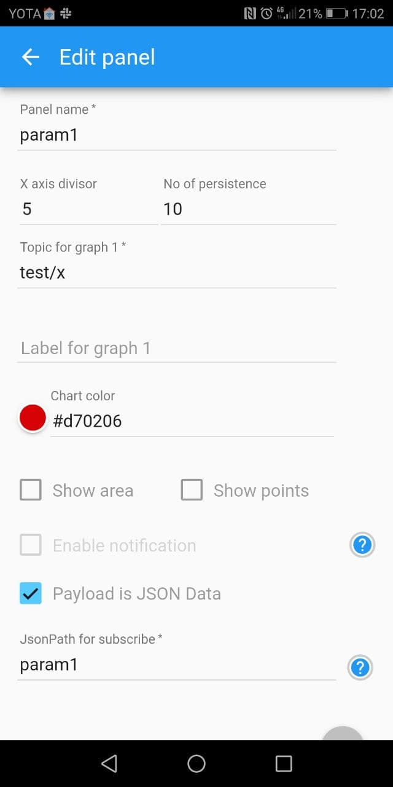
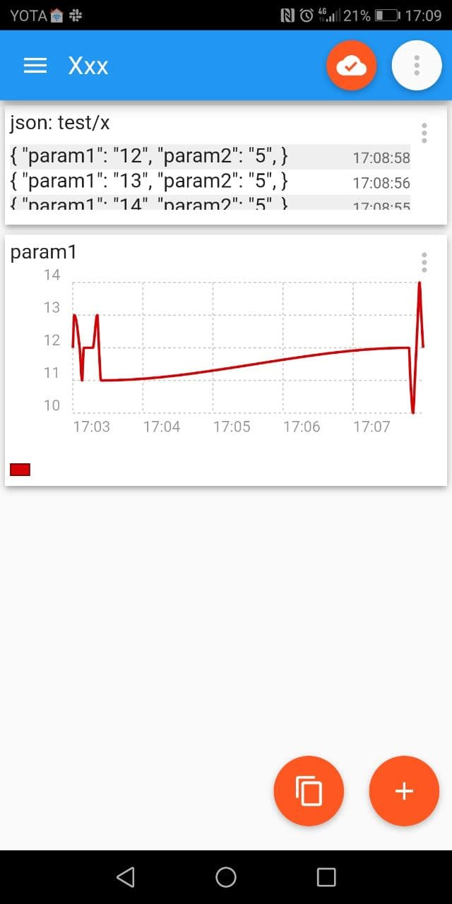

# Connect object to `IoT MQTT Panel` app

### 1. Create new MQTT object for panel app



### 2. Create automaton with 2 models



Automaton will send PUBLISH command to MQTT IoT panel object for every packet from first device.  



For PUBLISH command specify custom payload, for example:

```json
{
  "param1": "{{objects[0].state.speed}}",
  "param2": "{{objects[0].state.angle}}"
}
```

### 3. Start automaton



### 4. In `IoT MQTT Panel` app specify topics for panels:

config | view
-------|-----
 | 


